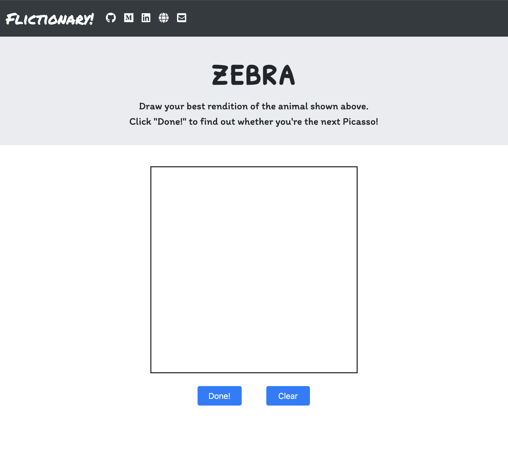

# Flictionary-Flask

This is the current state of the Flask app run on local server.  Will deploy a different version and soon to Heroku after meeting up with a software engineer to review front-end code.

https://github.com/Lexie88rus/quick-draw-image-recognition

In its current state, most of the front-end code is the work of: ...
